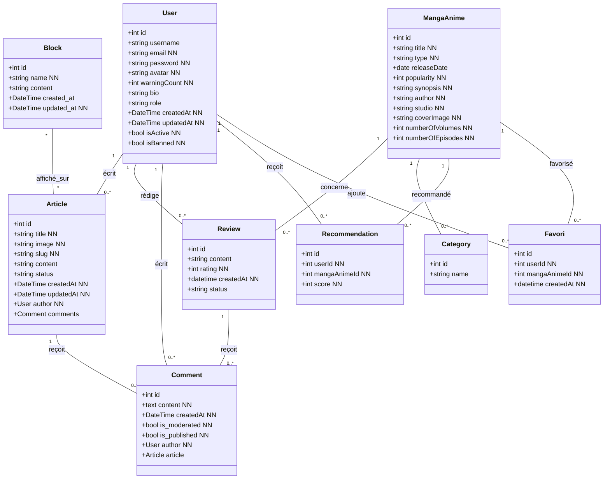
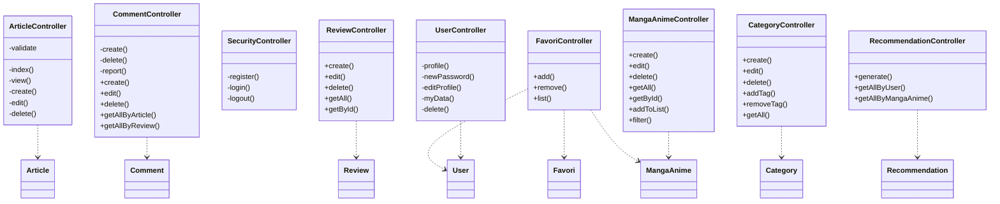
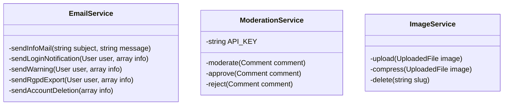
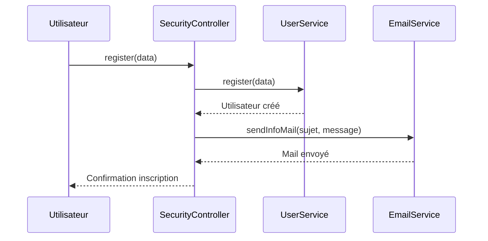
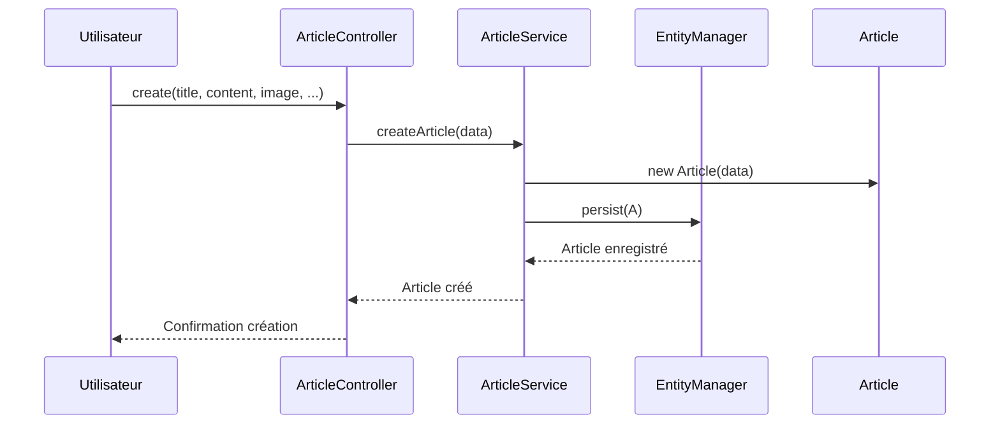
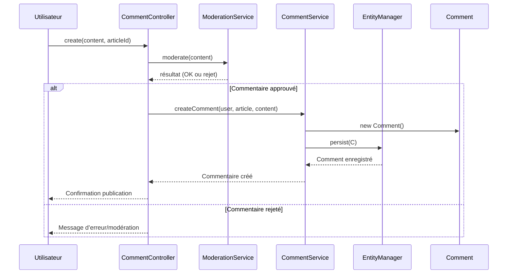
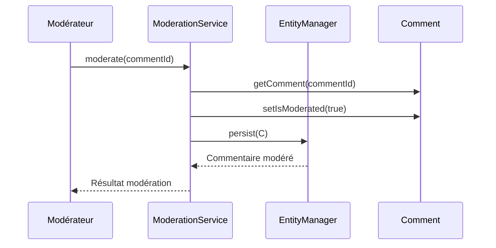
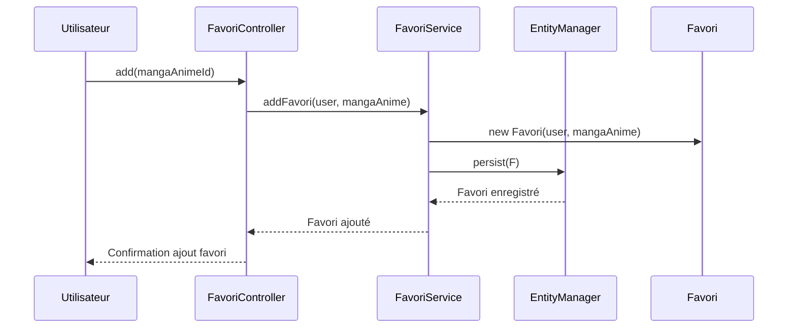
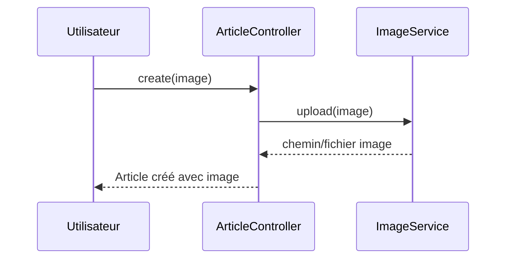

# BLOG MANGAS/ANIMES

## PRESENTATION

Mon application de blog dédiée au manga et à l’anime s’adresse avant tout aux passionnés de culture japonaise, qu’ils soient lecteurs assidus de mangas, amateurs d’animes, ou simples curieux souhaitant découvrir cet univers foisonnant. Elle vise aussi bien les fans expérimentés, désireux de partager leurs avis et découvertes, que les néophytes à la recherche de recommandations fiables et d’informations claires sur les œuvres incontournables du moment.

Cette plateforme répond à plusieurs problématiques majeures rencontrées par la communauté. D’une part, elle centralise l’information : il n’est plus nécessaire de naviguer entre différents sites pour trouver des critiques, des classements, des résumés ou des actualités sur les dernières sorties. D’autre part, elle facilite l’interaction et l’échange entre membres grâce à des systèmes de commentaires, de notations et de recommandations personnalisées, permettant à chacun de partager ses coups de cœur ou de débattre autour de ses séries préférées. Enfin, elle aide les utilisateurs à organiser leur parcours de lecture ou de visionnage grâce à des outils de suivi (progression, listes d’envies, notifications sur les nouveautés), évitant ainsi d’oublier où ils en sont dans leurs séries ou de passer à côté de titres majeurs.

L’utilisation de l’application est simple et intuitive. Après inscription, chaque membre peut explorer la bibliothèque de mangas et d’animes, consulter des fiches détaillées, lire ou rédiger des critiques, noter les œuvres et interagir avec la communauté. Un moteur de recherche avancé et des filtres par genre, popularité ou nouveauté facilitent la découverte de nouvelles séries adaptées à ses goûts. Les créateurs de contenu peuvent également publier leurs propres articles, analyses ou recommandations, enrichissant ainsi la base de connaissances partagée.

Mon intérêt pour ce projet est avant tout né de ma passion pour la culture manga et anime, mais aussi de l’envie de créer un espace convivial et riche pour une communauté souvent dispersée. Je souhaite offrir un outil qui valorise la découverte, l’échange et la créativité, tout en mettant en avant la diversité et la richesse de cet univers. Ce projet est aussi l’occasion de développer mes compétences techniques et éditoriales, tout en contribuant à la promotion d’une culture qui me tient à cœur.

## USER STORIES

* En tant qu’admin, je souhaite pouvoir valider, modifier ou supprimer les articles et critiques publiés par les utilisateurs afin de garantir la qualité et la pertinence des contenus sur le blog.
* En tant qu’admin, je souhaite pouvoir modérer, éditer ou supprimer les commentaires inappropriés afin de maintenir un espace de discussion respectueux et agréable pour tous.
* En tant qu’admin, je souhaite pouvoir consulter la liste des membres inscrits, modifier leurs rôles ou désactiver des comptes afin de gérer efficacement la communauté et prévenir les abus.
* En tant qu’admin, je souhaite pouvoir publier des actualités ou annonces importantes sur la page d’accueil afin de tenir la communauté informée des nouveautés ou événements à venir.
* En tant qu’admin, je souhaite recevoir et traiter les signalements d’abus ou de contenus inappropriés afin de réagir rapidement et protéger la communauté.
* En tant qu’admin, je souhaite pouvoir créer, modifier ou supprimer des catégories et des tags afin d’organiser efficacement les contenus et faciliter la navigation des utilisateurs.
* En tant qu'utilisateur je souhaite m'inscrire afin d'acceder à l'application de blog d'édiée au mangas et à l'animé
* En tant que nouvel utilisateur passionné de manga, je veux pouvoir consulter facilement les critiques et classements des derniers mangas et animes afin de découvrir de nouvelles œuvres à lire ou à regarder
* En tant que membre inscrit, je veux pouvoir rédiger et publier des critiques sur les mangas et animes que j’ai vus afin de partager mon opinion avec la communauté.
* En tant qu’utilisateur, je veux commenter les articles et critiques des autres membres afin d’échanger des avis et débattre sur mes séries préférées.
* En tant qu’utilisateur régulier, je veux pouvoir ajouter des mangas et animes à une liste de suivi afin de ne pas oublier où j’en suis dans mes lectures ou visionnages.
* En tant qu’utilisateur, je veux recevoir des recommandations personnalisées basées sur mes goûts et mes évaluations afin de découvrir des titres qui pourraient me plaire.
* En tant qu’utilisateur, je veux pouvoir filtrer les mangas et animes par genre, popularité ou date de sortie afin de trouver rapidement ce qui m’intéresse.
* En tant que membre, je veux pouvoir personnaliser mon profil avec un avatar et une biographie afin de mieux me présenter à la communauté.
* En tant qu’utilisateur, je veux être notifié lorsqu’un nouvel article ou une nouvelle critique est publiée sur une série que je suis afin de rester informé des dernières actualités.

## Liste priorisée de user stories

| Priorité | Rôle                 | Action                                                                 | Bénéfice                                                             |
| :-------: | --------------------- | ---------------------------------------------------------------------- | ---------------------------------------------------------------------- |
|     1     | Visiteur              | Consulter la liste des articles                                        | Découvrir rapidement le contenu disponible                            |
|     2     | Visiteur              | Lire un article détaillé                                             | Approfondir un sujet d’intérêt                                      |
|     3     | Utilisateur           | S’inscrire / se connecter                                             | Participer (commentaires) et accéder aux fonctionnalités protégées |
|     4     | Utilisateur connecté | Poster un commentaire                                                  | Partager son avis et échanger                                         |
|     5     | Utilisateur connecté | Éditer ou supprimer son propre commentaire                            | Gérer et corriger son contenu                                         |
|     6     | Administrateur        | Créer / supprimer un article via EasyAdmin                            | Gérer le contenu du blog de manière structurée                      |
|     7     | Administrateur        | Gérer (activer/désactiver) et modérer les commentaires              | Maintenir un espace de discussion respectueux des CGU                  |
|     8     | Administrateur        | Gérer les utilisateurs (rôles, blocage)                              | Contrôler l’accès et la sécurité du site                          |
|     9     | Administrateur        | Configurer les blocs dynamiques du front (header, footer, sidebar)     | Personnaliser la mise en page sans recoder                             |
|    10    | Administrateur        | Consulter des statistiques basiques (nombre d’articles, commentaires) | Suivre l’activité du site                                            |

### Services

## 📘 Models (Database/Class Diagram)

## 🧭 Controllers

## 🔧 Services

## Diagramme de sequence

### Create article

### Post a comment

### Moderation of comments

### Add favori

### Teléversement d'un image 

